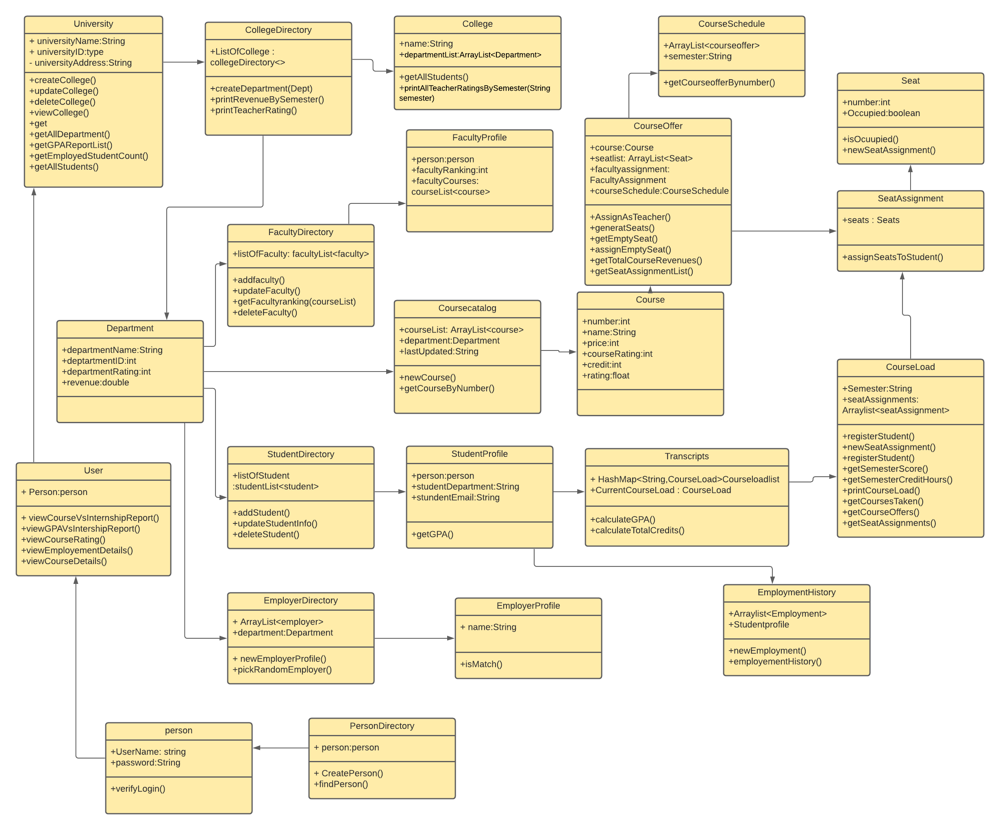
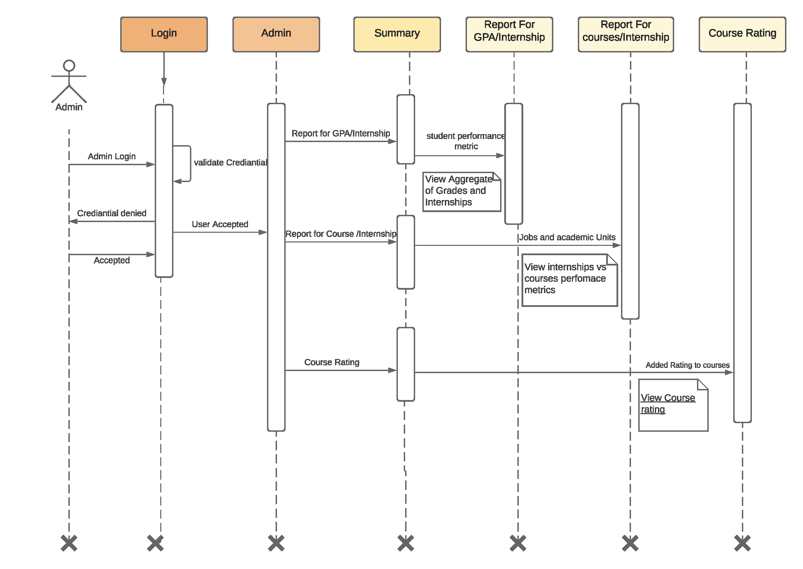
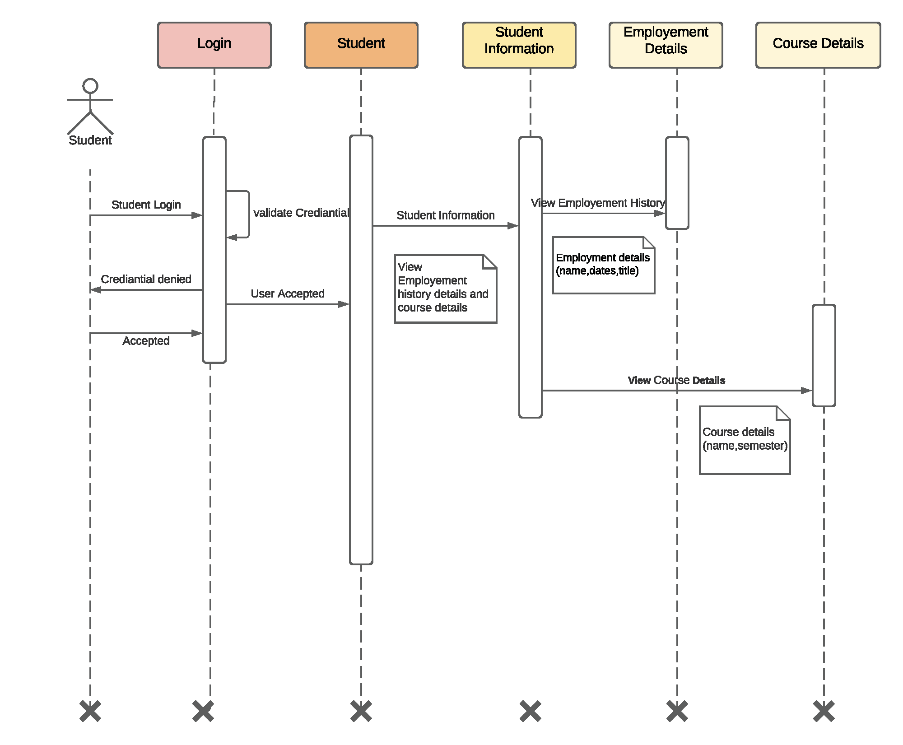
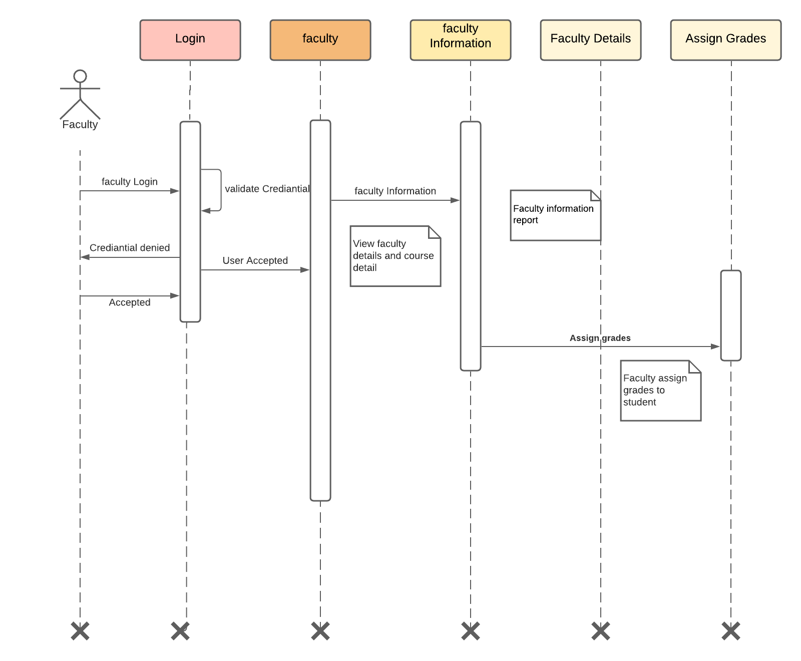

# INFO5100-Team-Assignment (University Model)

## Application Engineering & Development – Summer 2021

### Deliverables

1.	Running java code showing the implementation of a complete system at the department and college levels. 
2.	Presentation outlining your solution and implementation. 
3.	Sequence diagrams showing how to navigate the university object model to deliver performance metrics needed for performance and feedback. 
4.	An object model showing the changes to the university model to support the new capabilities. 
5.	This must include the additional methods and attributes required to deliver the results. 
6.	Investigate how we create digital education systems assuming a university is an intermediary (broker) between students and employers. Their brand is about credibility. How the implementation code will change based on this assumption? 
7.	Your application must enable the creation and update functions for any of the attributes of concern. 

### Object Model

### Sequence Diagrams
#### Admin

#### Student

#### Faculty
